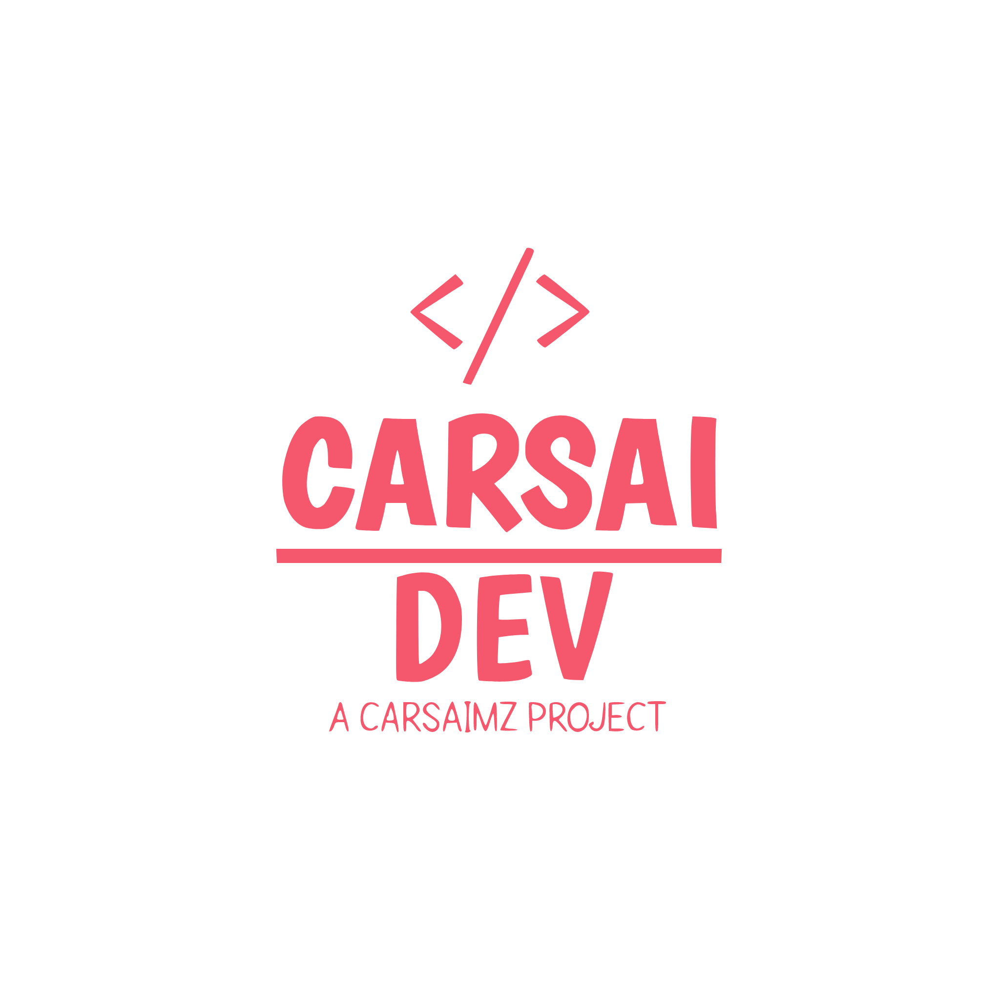

# Olá, eu sou Carimo Saide 👋

 

<!-- Contador de Visitas com Personagens Anime -->

 

---

## 🚀 Sobre Mim

- 💼 **CEO & Fundador** da [Carsai Mozambique](https://carsaimz.linkpc.net)
- 💻 Desenvolvedor Web Full Stack de **Moçambique** 🇲🇿
- 🌱 Construindo soluções digitais desde **2022**
- 🎯 Missão: Democratizar o acesso à tecnologia em África
- 📚 Atualmente expandindo o ecossistema Carsai
- ⚡ Curiosidade: Transformo ideias em realidade através de código

 

---

## 🛠️ Stack Tecnológica

### Linguagens

### Ferramentas & Tecnologias

---

## 🌐 Ecossistema Carsai Mozambique

### 🚀 Minhas Plataformas

<table>
  <tr>
    <td align="center" width="180">
       
      <strong>💻 CarsaiDev</strong> 
      Desenvolvimento Web  
      
      
    </td>
    <td>
      <h3>🎨 Desenvolvimento Web Profissional</h3>
      
Criação de sites personalizados, sistemas web e soluções digitais sob medida para seu negócio.

      <ul>
        <li>✨ Sites Institucionais</li>
        <li>🛒 E-commerce</li>
        <li>📱 Sistemas Responsivos</li>
      </ul>
    </td>
  </tr>
  <tr>
    <td align="center">
       
      <strong>☁️ Carsai Host</strong> 
      Hospedagem Gratuita  
      
    </td>
    <td>
      <h3>🌐 Plataforma de Hospedagem Web</h3>
      
Hospedagem gratuita e acessível para seus projetos web. Tenha seu site online sem custos iniciais.

      <ul>
        <li>🆓 Hospedagem Gratuita</li>
        <li>🔒 SSL Certificado</li>
        <li>⚡ Alta Disponibilidade</li>
      </ul>
    </td>
  </tr>
  <tr>
    <td align="center">
       
      <strong>📚 Carsai LMS</strong> 
      Cursos Online  
      
    </td>
    <td>
      <h3>🎓 Sistema de Gestão de Aprendizagem</h3>
      
Plataforma completa de cursos online com conteúdo de qualidade e certificações reconhecidas.

      <ul>
        <li>📖 Cursos Variados</li>
        <li>🏆 Certificados</li>
        <li>👨‍🏫 Aprendizado Flexível</li>
      </ul>
    </td>
  </tr>
  <tr>
    <td align="center">
       
      <strong>💼 Carsai BMS</strong> 
      Gestão Empresarial  
      
    </td>
    <td>
      <h3>📊 Sistema de Gestão de Negócios</h3>
      
Software completo para gerenciar seu negócio: vendas, estoque, finanças e muito mais.

      <ul>
        <li>💰 Ponto de Venda (PDV)</li>
        <li>📦 Controle de Estoque</li>
        <li>📈 Relatórios Gerenciais</li>
      </ul>
    </td>
  </tr>
  <tr>
    <td align="center">
       
      <strong>🌍 Carsai IPT</strong> 
      Ensino de Inglês  
      
    </td>
    <td>
      <h3>🗣️ Instituto de Ensino de Inglês</h3>
      
Cursos especializados de língua inglesa com metodologia moderna e professores qualificados.

      <ul>
        <li>🎯 Inglês para Iniciantes</li>
        <li>💼 Inglês para Negócios</li>
        <li>🎓 Preparação para Certificações</li>
      </ul>
    </td>
  </tr>
</table>

---

## 📊 Estatísticas do GitHub

### 🔥 Sequência de Contribuições

### 📈 Estatísticas Gerais

  
  

### 🏆 Troféus do GitHub

### 📊 Gráfico de Atividade

### 🐍 Contribuições Snake

---

## 🎯 Projetos em Destaque

---

## 📫 Entre em Contato

### 💼 Contatos Profissionais

| 📧 Pessoal | 🏢 Empresarial | 💻 Desenvolvimento | 🆘 Suporte |
|:---:|:---:|:---:|:---:|
| [carimosaidempinda@gmail.com](mailto:carimosaidempinda@gmail.com) | [carsaimozambique@gmail.com](mailto:carsaimozambique@gmail.com) | [carsaideveloper@gmail.com](mailto:carsaideveloper@gmail.com) | [suporte.carsaimz@gmail.com](mailto:suporte.carsaimz@gmail.com) |
| *Networking* | *Parcerias* | *Projetos* | *Técnico* |

### 🌐 Redes Sociais

---

## 🤝 Apoie & Contribua

Se você gosta do meu trabalho, considere:

⭐ **Dar estrela** nos repositórios  
🐛 **Reportar** bugs e problemas  
💡 **Sugerir** novas funcionalidades  
🔄 **Compartilhar** com sua rede  
📝 **Contribuir** para open source

---

## 📈 Trajetória

| 📅 Ano | 🎯 Marco Importante |
|:---:|:---|
| **2022** | 🚀 Fundação da Carsai Mozambique - O início de tudo |
| **2025** | 🎯 Lançamento do Ecossistema Completo (5 plataformas integradas) |
| **2026** | 🌟 Expansão e crescimento contínuo |

---

### 💭 Citação de Desenvolvedor

---

### ✨ Obrigado por visitar! ✨

**Feito com ❤️ em Moçambique 🇲🇿**

*Construindo soluções digitais acessíveis para todos*

**© 2022 - 2026 Carsai Mozambique • Todos os direitos reservados**

