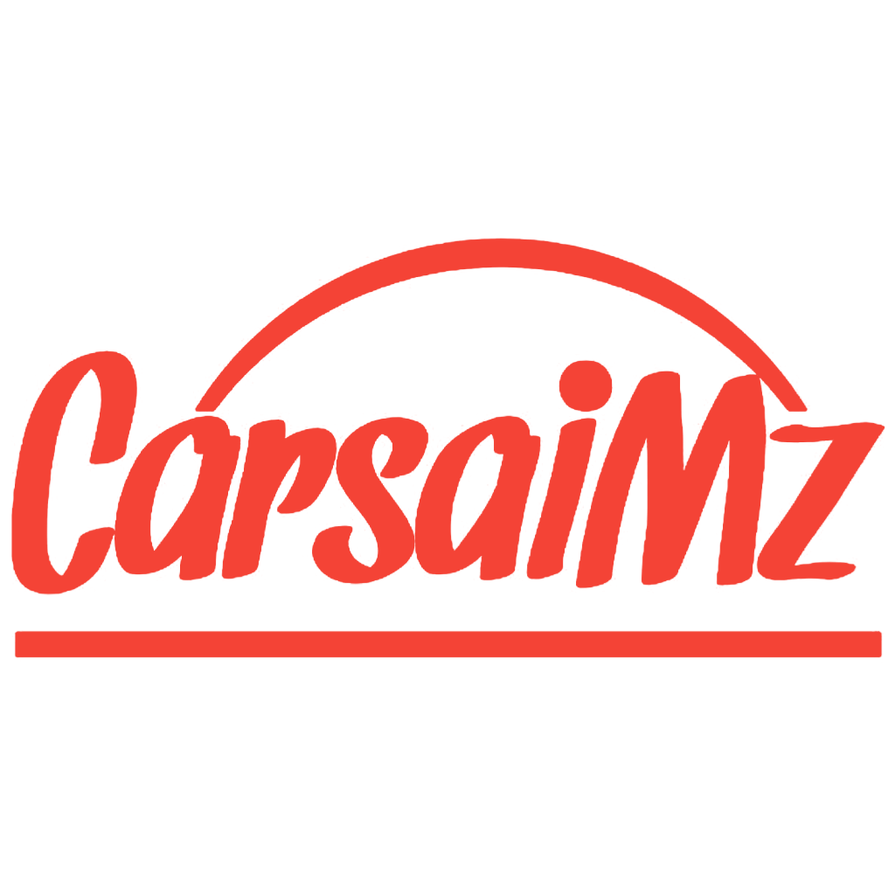
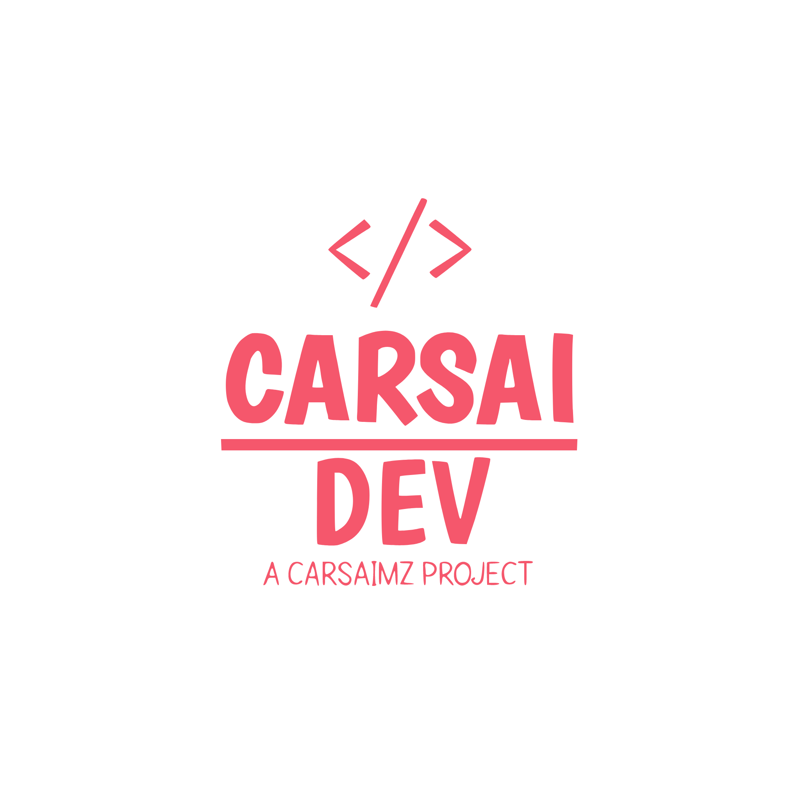
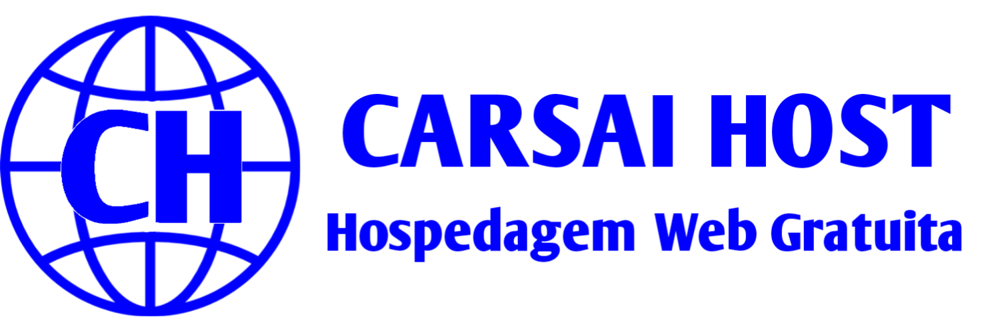

<div align="center">



# Carsai Mozambique

### Soluções Digitais & Hospedagem Web Gratuita

[](https://carsai.mz)
[](https://github.com/carsaimz)
[](https://wa.me/258847545020)

**Plataforma multiplataforma de serviços digitais para Moçambique** — Web, Android e Windows. Hospedagem web gratuita, desenvolvimento web profissional, cursos online e ensino de inglês, tudo num único ecossistema integrado.

</div>

---

## 🌐 Ecossistema Carsai

<table>
  <tr>
    <td align="center" width="160">
      <br>
      <strong>CarsaiDev</strong><br>
      <sub>Desenvolvimento Web</sub><br><br>
      <a href="https://carsaidev.linkpc.net">
        
      </a>
    </td>
    <td>
      <h3>Desenvolvimento Web Profissional</h3>
      <p>Criação de sites personalizados, sistemas web e soluções digitais sob medida para o seu negócio. Desde landing pages até plataformas e-commerce completas, com design responsivo e optimizado para SEO.</p>
      <ul>
        <li>Sites Institucionais & Landing Pages</li>
        <li>E-commerce & Sistemas de Gestão</li>
        <li>Aplicações Web & Mobile (Android)</li>
      </ul>
    </td>
  </tr>
  <tr>
    <td align="center">
      <br>
      <strong>Carsai Host</strong><br>
      <sub>Hospedagem Gratuita</sub><br><br>
      <a href="https://carsaihost.linkpc.net">
        
      </a>
    </td>
    <td>
      <h3>Hospedagem Web Gratuita</h3>
      <p>Hospedagem Apache partilhada fornecida por ifastnet/byet — sem custos. Coloque o seu site online com SSL gratuito, painel de controlo e suporte técnico. Ideal para projectos pessoais, portfólios e pequenos negócios.</p>
      <ul>
        <li>Hospedagem Apache 100% Gratuita</li>
        <li>Certificados SSL (Let's Encrypt)</li>
        <li>Painel de Controlo & Suporte</li>
      </ul>
    </td>
  </tr>
  <tr>
    <td align="center">
      <br>
      <strong>Carsai LMS</strong><br>
      <sub>Cursos Online</sub><br><br>
      <a href="https://carsailms.linkpc.net">
        
      </a>
    </td>
    <td>
      <h3>Sistema de Gestão de Aprendizagem</h3>
      <p>Plataforma completa de cursos online com conteúdo de qualidade e certificações. Aprenda no seu ritmo, com aulas em vídeo, materiais de apoio e acompanhamento personalizado.</p>
      <ul>
        <li>Cursos Variados & Certificados</li>
        <li>Aprendizagem Flexível (online, 24/7)</li>
        <li>Acompanhamento de Progresso</li>
      </ul>
    </td>
  </tr>
  <tr>
    <td align="center">
      <br>
      <strong>Carsai IPT</strong><br>
      <sub>Ensino de Inglês</sub><br><br>
      <a href="https://carsaiipt.linkpc.net">
        
      </a>
    </td>
    <td>
      <h3>Instituto de Ensino de Inglês</h3>
      <p>Cursos especializados de língua inglesa com metodologia moderna e professores qualificados. Do básico ao avançado, com turmas presenciais e online para todos os níveis.</p>
      <ul>
        <li>Inglês para Iniciantes & Intermediários</li>
        <li>Inglês para Negócios & Profissional</li>
        <li>Preparação para Certificações</li>
      </ul>
    </td>
  </tr>
  <tr>
    <td align="center">
      <br>
      <strong>Inglês Para Todos</strong><br>
      <sub>Comunidade</sub><br><br>
      <a href="https://carsaiipt.linkpc.net">
        
      </a>
    </td>
    <td>
      <h3>Comunidade de Aprendizagem de Inglês</h3>
      <p>Espaço comunitário dedicado ao ensino de inglês acessível para todos. Recursos gratuitos, exercícios práticos e suporte de uma comunidade activa de aprendentes.</p>
      <ul>
        <li>Recursos Gratuitos & Exercícios</li>
        <li>Comunidade Activa de Aprendentes</li>
        <li>Materiais de Apoio Multimédia</li>
      </ul>
    </td>
  </tr>
</table>

---

## 🛠️ Serviços

| Serviço | Descrição | Preço |
|---------|-----------|-------|
| **Desenvolvimento Web** | Sites, web apps e e-commerce personalizados | A partir de MT 5.000 |
| **Hospedagem Web** | Apache partilhada por ifastnet/byet | **Gratuito** |
| **Registo de Domínios** | .mz, .com, .net, .org | Variável |
| **Certificados SSL** | Let's Encrypt (gratuito) e premium | Gratuito+ |
| **SEO** | Optimização para motores de busca | Sob consulta |
| **Apps Mobile** | Android e iOS | Sob consulta |
| **Design Gráfico** | Logótipos, branding, materiais | Sob consulta |

### Métodos de Pagamento

- **M-Pesa** (dinheiro móvel) — 847545020
- **Transferência Bancária**
- **Cartão de Crédito** (internacional)
- Moeda: Metical Moçambicano (MT) / USD

---

## 💻 Plataforma Carsai MZ

A plataforma principal ([carsai.mz](https://carsai.mz)) é construída com tecnologias modernas e disponível em 3 plataformas:

| Plataforma | Tecnologia | Estado |
|-----------|-----------|--------|
| **Web** | Next.js 16 + Vercel | Disponível |
| **Android** | Capacitor 8 | Em desenvolvimento |
| **Windows** | Electron | Em desenvolvimento |

### Funcionalidades da Plataforma

- **Autenticação** — Email/Password, Google, Phone SMS, Anónimo
- **Blog & Fórum** — Publicações, comentários, categorias
- **Serviços & Projetos** — Catálogo e portfólio
- **Orçamentos & Faturas** — Sistema de cotações e pagamentos
- **Suporte** — Tickets de suporte com chat
- **Newsletter** — Subscrição de emails
- **Notificações Push** — Firebase Cloud Messaging
- **Admin Dashboard** — Painel de administração completo
- **8 Idiomas** — PT, EN, FR, ES, DE, ZH, SW, PT-BR

### Stack Tecnológica

| Camada | Tecnologia |
|--------|-----------|
| **Frontend** | Next.js 16, React 19, TypeScript, Tailwind CSS 4, shadcn/ui |
| **Backend** | Next.js API Routes (serverless) |
| **Database** | Firebase Firestore (Spark Plan gratuito) |
| **Auth** | Firebase Auth (Email, Google, Phone, Anonymous) |
| **Mobile** | Capacitor 8 (Android) |
| **Desktop** | Electron (Windows Portable EXE) |
| **CI/CD** | GitHub Actions + Vercel |

---

## 🚀 Quick Start

```bash
# Clone o repositório
git clone https://github.com/carsaimz/carsaimz.git
cd carsaimz

# Instalar dependências
bun install

# Configurar ambiente (Firebase Admin SDK)
# Copiar .env.example para .env e preencher credenciais
cp .env.example .env

# Iniciar desenvolvimento
bun run dev
```

---

## 📫 Contacto

| Canal | Endereço |
|-------|----------|
| **Email** | carsaimozambique@gmail.com |
| **Suporte** | suporte.carsaimz@gmail.com |
| **WhatsApp** | +258 847545020 |
| **M-Pesa** | 847545020 / 874512581 |
| **Localização** | Montepuez, Cabo Delgado, Moçambique |
| **Facebook** | [facebook.com/carsaimz](https://facebook.com/carsaimz) |
| **Instagram** | [instagram.com/carsaimz](https://instagram.com/carsaimz) |
| **TikTok** | [tiktok.com/@carsaimz](https://tiktok.com/@carsaimz) |
| **Discord** | [discord.gg/carsaimz](https://discord.gg/carsaimz) |
| **YouTube** | [youtube.com/@carsaimz](https://youtube.com/@carsaimz) |
| **GitHub** | [github.com/carsaimz](https://github.com/carsaimz) |

---

<div align="center">

**Feito com ❤️ em Moçambique 🇲🇿**

*Democratizando o acesso à tecnologia em África*

© 2022–2026 Carsai Mozambique • Todos os direitos reservados

</div>
